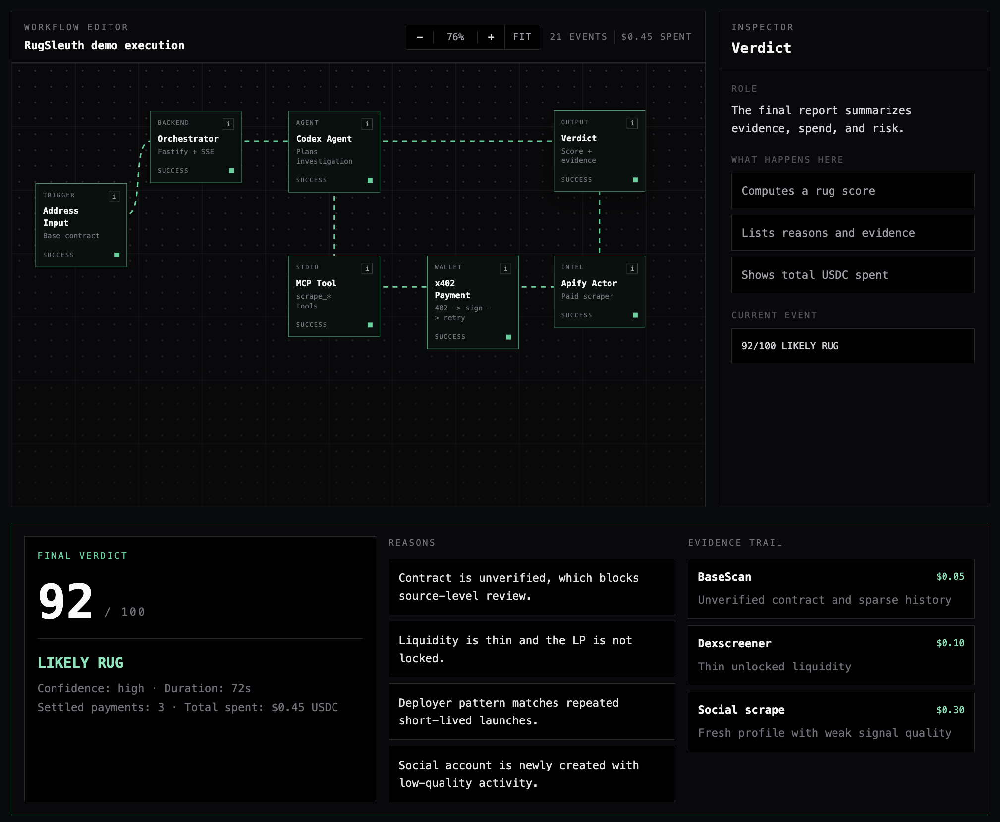

# RugSleuth

*An autonomous onchain investigator that pays for its own intel via x402.*

> **ETH Prague 2026 — Apify Bounty submission**
> Status: Design / pre-build · Branch: `jstudnic`

---

## TL;DR

You paste a suspect token contract address. RugSleuth — an autonomous agent with its own USDC wallet on Base — investigates it live in front of you. It buys onchain data (BaseScan), liquidity data (Dexscreener), and social signals (X/Twitter) by paying Apify Actors per call via the **x402** protocol. Each payment is visible in real time. After ~30–90 seconds and a few dollars of USDC spent, it returns a forensic dossier and a rug score: *"92% confidence this is a rug. Here's why."*

The agent is not a hand-rolled LLM loop. It runs inside **Codex CLI** (GPT-5.x agent harness), with our paid scrapers exposed via a custom MCP server. Codex picks what to investigate, recovers from failures, writes its own scratch reports, and decides when it has enough evidence.




---

## 1. Context

### 1.1 The bounty

> *"Integrate Apify through the X402 protocol into your project, DApp, application, agent, or workflow, and show a real, tangible use case of paying for services, or Peer-to-Peer payments, for example, an agent paying another agent."*

Judging criteria:

1. **Relevance** of the use case
2. **Functionality** and a successful payment demo
3. **Creativity** of the integration

### 1.2 Why this idea fits

| Criterion | How RugSleuth scores |
|---|---|
| Relevance | Rug-pulls are a constant, costly Web3 problem. Every memecoin trader on Base needs this. The investigator pattern generalises to any due-diligence workflow (DeFi, OTC, lending, governance). |
| Functionality | Every scrape is a *visible* x402 micropayment. The agent literally cannot work without paying. Demo proves the protocol end-to-end. |
| Creativity | The agent **owns its own wallet** and **decides what to spend on**. This is exactly what x402 was designed for — autonomous agents transacting without a human-held account — and the bounty's stated archetype. |

### 1.3 Why now

x402 is new. The existing demos in the docs (curl + manual signing, or `mcpc` interactive shell) are mechanical. None of them tell a story. RugSleuth wraps the protocol in a use case that audiences understand instantly and want to try.

---

## 2. Problem statement

A trader sees a freshly-deployed Base token in their feed. To decide whether it's a rug or worth a bet, they would have to:

- Open BaseScan, copy the deployer, check what else they've launched.
- Switch to Dexscreener, eyeball LP, holder distribution, sniper count.
- Search Twitter, scroll the project's account, judge whether the followers are real.
- Stitch all of it into a verdict, fast, before the price moves.

Today this takes a careful trader 5–15 minutes per token. A casual trader skips it and gets rugged. **An agent can do it in under two minutes for under two dollars** — but only if it can transact autonomously, without an Apify account, an API key, or a credit card. That is the gap x402 fills.

---

## 3. Goals and non-goals

### 3.1 Goals

- **G1** — End-to-end x402 payment flow against real Apify Actors, demonstrably visible to the audience.
- **G2** — A genuinely autonomous agent: chooses which scrapes to buy, manages its own budget, recovers from failures.
- **G3** — Compelling 5-minute live demo with a verdict on a real or staged contract.
- **G4** — At least one Apify Actor we own (the extended `basescan-deep` Actor) configured with PPE pricing and callable via x402.
- **G5** — Multi-source intel: at minimum BaseScan + Dexscreener + one social source.

### 3.2 Non-goals

- ❌ Production scale or multi-tenant. One concurrent investigation is fine for the demo.
- ❌ ML-grade rug-detection accuracy. The rubric is heuristic, transparent, and explainable — not a black box.
- ❌ Wallet UX for end users. The agent has the wallet. Users do not connect a wallet to use it.
- ❌ Cross-chain. Base only.
- ❌ Selling the dossier as a service post-hackathon. (Possible follow-up; out of scope here.)

---

## 4. Personas and user stories

### 4.1 Primary persona — *Memecoin Mike*

A retail trader on Base. Active on X, watches new launches. Has been rugged twice this month. Wants a fast verdict before he apes in.

**User story:** *As Mike, I paste a suspicious contract address into RugSleuth and within 90 seconds I see a clear verdict and the evidence behind it, so I can decide whether to buy.*

### 4.2 Secondary persona — *DeFi Diana*

A protocol risk analyst at a lending platform. Needs to spot-check tokens being proposed as collateral.

**User story:** *As Diana, I send a token contract to RugSleuth and receive a structured dossier I can attach to a governance proposal, so my colleagues can audit my reasoning.*

### 4.3 Tertiary persona — *Hackathon Judge Hannah*

Wants to see x402 actually working, end-to-end, in five minutes.

**User story:** *As Hannah, I watch a live agent spend USDC on real Apify Actors and produce a coherent verdict, so I can confirm the integration is real, not a mockup.*

---

## 5. Success metrics

| # | Metric | Target |
|---|---|---|
| M1 | Successful x402 payments per investigation | ≥ 3 |
| M2 | Total wall-clock time per investigation | ≤ 120 s |
| M3 | Total USDC spent per investigation | ≤ $2.00 |
| M4 | Live demo completion without manual intervention | 100% over 3 dry runs |
| M5 | Audience can name what x402 does after the demo | ≥ 80% in a quick survey |

---

## 6. Functional requirements

### 6.1 Investigation lifecycle

- **FR-1** The system shall accept a Base contract address from the user via a web UI.
- **FR-2** The system shall validate the address (EIP-55 checksum or 0x-prefixed 40-hex-char) before starting.
- **FR-3** The system shall start an investigation with a configurable USDC budget cap (default: $2.00).
- **FR-4** The system shall stream all agent activity to the UI in real time (target latency: ≤ 1 s).
- **FR-5** The system shall terminate the investigation when (a) the agent renders a verdict, (b) the budget is exhausted, or (c) a hard timeout (180 s) is reached.

### 6.2 Agent behaviour

- **FR-6** The agent shall be implemented as a Codex CLI subprocess with a fixed system prompt encoding the rug-detection rubric.
- **FR-7** The agent shall have access to **at minimum** these tools, exposed via a custom MCP server:
  - `scrape_basescan_address(address)` — balance, recent txs, contract verification status.
  - `scrape_basescan_deployer(address)` — deployer wallet, other contracts deployed by the same deployer.
  - `scrape_basescan_holders(address)` — holder count and distribution.
  - `scrape_dexscreener_pair(address)` — pair address, liquidity, lock status, top traders.
  - `scrape_twitter_profile(handle)` — account age, follower count, bio, recent tweet sample.
  - `get_wallet_balance()` — remaining USDC budget.
  - `render_verdict({ score, label, reasons[], evidence[] })` — emit final verdict and end the investigation.
- **FR-8** The agent shall decide which tools to invoke. The orchestrator shall not preselect a tool sequence.
- **FR-9** The agent shall be able to abort early if a confident verdict is reachable on partial evidence.

### 6.3 x402 payment flow

- **FR-10** Each tool call shall trigger one or more HTTPS requests to Apify with the header `X-APIFY-PAYMENT-PROTOCOL: X402`.
- **FR-11** On HTTP 402 responses, the x402 client shall parse the `PAYMENT-REQUIRED` header and sign it via EIP-712 using the agent's hot wallet (private key in env var).
- **FR-12** The x402 client shall resend the request with `PAYMENT-SIGNATURE` and use the resulting prepaid balance for subsequent calls until expiry (60 min idle).
- **FR-13** The system shall emit `payment.required`, `payment.signed`, `payment.settled`, and `payment.failed` events to the UI for each x402 transaction.

### 6.4 Verdict

- **FR-14** The verdict shall include:
  - Numeric score 0–100 (likelihood of rug)
  - Categorical label: `LIKELY_RUG`, `SUSPICIOUS`, `INCONCLUSIVE`, `LIKELY_LEGIT`
  - At least three textual reasons referencing concrete evidence
  - The full evidence trail (which tools were called, what they returned)
  - Total USDC spent, total wall-clock time
- **FR-15** The verdict shall be downloadable as JSON.

---

## 7. Non-functional requirements

| # | Requirement |
|---|---|
| NFR-1 | All secrets (Anthropic/OpenAI API keys, wallet private key, Apify token if needed) live in env vars; never committed. |
| NFR-2 | The agent's wallet shall hold ≤ $20 USDC on Base at any time during a demo (blast radius cap). |
| NFR-3 | The orchestrator shall enforce a hard budget cap on the agent — if exceeded, terminate. |
| NFR-4 | The system shall log every x402 request/response (sanitised) for post-demo verification. |
| NFR-5 | Codex stdout/stderr shall be captured per-investigation; the verdict response shall include the path. |
| NFR-6 | All TypeScript code shall pass `tsc --noEmit`, ESLint, and Prettier before commit. |
| NFR-7 | Each module shall have at least one unit test for its public API. |

---

## 8. System architecture

```
                    ┌────────────────────────────────────────┐
                    │        BROWSER  (Next.js dashboard)    │
                    │  • address input + Start button        │
                    │  • Codex transcript panel              │
                    │  • x402 payment event feed             │
                    │  • wallet balance ticker               │
                    │  • final verdict card                  │
                    └────────────────┬───────────────────────┘
                                     │ HTTP + SSE
                    ┌────────────────▼───────────────────────┐
                    │   ORCHESTRATOR  (Node/TS service)      │
                    │  • spawns `codex` per investigation    │
                    │  • streams stdout/stderr → SSE         │
                    │  • parses payment events from MCP logs │
                    │  • enforces budget + timeout           │
                    └────────────────┬───────────────────────┘
                                     │ child process (stdio)
                    ┌────────────────▼───────────────────────┐
                    │         CODEX CLI (GPT-5.x)            │
                    │  Agent harness with bash, fs,          │
                    │  scratchpad, multi-step planning.      │
                    │  System prompt = rug-detection rubric. │
                    └────────────────┬───────────────────────┘
                                     │ MCP (stdio)
                    ┌────────────────▼───────────────────────┐
                    │   rugcheck-mcp  (custom MCP server)    │
                    │  Tools → x402-client                   │
                    └────────────────┬───────────────────────┘
                                     │ uses
                    ┌────────────────▼───────────────────────┐
                    │   x402-client  (viem + fetch)          │
                    │  • signs EIP-712 challenges            │
                    │  • holds the agent's hot wallet        │
                    │  • parses 402 → signs → resends        │
                    │  • emits structured payment events     │
                    └────────────────┬───────────────────────┘
                                     │ HTTPS (X402 headers)
                    ┌────────────────▼───────────────────────┐
                    │           APIFY PLATFORM               │
                    │  • our Actor: basescan-deep (PPE)      │
                    │  • Store Actor: twitter-scraper (PPE)  │
                    │  • Store Actor: dexscreener (PPE)      │
                    └────────────────┬───────────────────────┘
                                     ▼
                    Base mainnet — USDC settlement.
                    On-chain only on first payment per session;
                    rest is prepaid drawdown (≤ 60 min idle).
```

---

## 9. Component specifications

### 9.1 `basescan-deep` Apify Actor *(extends current `basescan-scraper/`)*

**Purpose:** Scrape rug-relevant data from BaseScan with PPE pricing so it is callable via x402.

**Endpoints (PPE events):**
- `address-fetched` — balance, contract verification, source code presence, age.
- `deployer-fetched` — for a given contract address, return its deployer wallet plus all other contracts that deployer launched (with launch dates).
- `holders-fetched` — top N holders, total holder count, concentration ratio.

**Pricing (placeholder, to confirm):**
- `address-fetched`: $0.05
- `deployer-fetched`: $0.10
- `holders-fetched`: $0.10

**PPE configuration:** declared in `.actor/actor.json` and surfaced via input schema.

### 9.2 `rugcheck-mcp` (custom MCP server)

**Purpose:** Bridge between Codex's tool-use protocol and the x402 client.

**Transport:** stdio, standard MCP.
**Language:** TypeScript.
**Dependencies:** `@modelcontextprotocol/sdk`, the in-repo `x402-client` module.

**Behaviour:**
- Each tool implementation:
  1. Build the Apify request URL and JSON body.
  2. Call `x402Client.fetch(url, body)`.
  3. Emit progress events (consumed by Codex and parsed by the orchestrator).
  4. Return a compact JSON summary (≤ 10 KB) to Codex.
- Tool failures return structured errors with hints (`"twitter rate-limited, try again in 60s or skip"`) so Codex can recover.

### 9.3 `x402-client`

**Purpose:** Self-contained x402 protocol client with EIP-712 signing.

**Public API (TS):**
```ts
interface X402Client {
  fetch(req: { url: string; method: string; body?: unknown }): Promise<{
    result: unknown;
    payments: PaymentEvent[];
  }>;
  getBalance(): Promise<bigint>; // prepaid USDC balance
  on(event: 'payment', cb: (e: PaymentEvent) => void): void;
}
```

**Internal flow:**
1. Send request with `X-APIFY-PAYMENT-PROTOCOL: X402`.
2. If 402:
   - Parse `PAYMENT-REQUIRED` value (EIP-712 typed-data challenge).
   - `account.signTypedData(...)` via `viem`.
   - Resend with `PAYMENT-SIGNATURE` header.
   - Emit `payment.required` → `payment.signed` → `payment.settled`.
3. On subsequent calls within 60 min, prepaid balance covers the cost; no new signature.

**Wallet management:**
- Single hot wallet, private key in `WALLET_PRIVATE_KEY` env var.
- Wallet pre-funded with $5–$10 USDC on Base before the demo.
- No on-chain transfers from this client; all settlement is by the Apify x402 endpoint.

### 9.4 Orchestrator (Node service)

**Purpose:** Bridge UI ↔ Codex, enforce policy.

**Endpoints:**
- `POST /investigations` — body `{ address, budgetUsd? }` → returns `{ id }`.
- `GET /investigations/:id/events` — SSE stream of all events.
- `GET /investigations/:id` — final verdict (after completion).

**Per-investigation steps:**
1. Validate address.
2. Allocate working dir `/tmp/rugsleuth/<id>/`.
3. Spawn `codex` with:
   - Fixed system prompt (rug-detection rubric).
   - User prompt: `"Investigate contract <address>. Budget: <budget> USDC."`
   - MCP server config pointing to `rugcheck-mcp`.
4. Pipe `codex` stdout/stderr → parser → SSE.
5. Watch for budget breaches; on breach, send SIGTERM to codex.
6. On `render_verdict` MCP tool call, capture verdict, finalise SSE, exit.

### 9.5 Dashboard (Next.js)

Three-pane layout:

```
┌──────────────────────────────────────────────────────────────┐
│  RugSleuth                       Wallet: 0xAB…  $4.23 USDC   │
├───────────────────────┬──────────────────────────────────────┤
│  Codex transcript     │  x402 payment events                 │
│                       │                                      │
│  ▸ Plan: I'll start   │  💸 0.05 USDC → basescan-deep        │
│    with deployer ...  │     (address-fetched) — settled     │
│  ▸ Tool: scrape_…     │                                      │
│  ▸ Result: deployer   │  💸 0.10 USDC → basescan-deep        │
│    has 14 prior …     │     (deployer-fetched) — settled    │
│  ▸ Plan: that's a     │                                      │
│    serial deployer …  │  💸 0.30 USDC → twitter-scraper      │
│                       │     (profile) — signed              │
│                       │                                      │
└───────────────────────┴──────────────────────────────────────┘
                ┌─────────────────────────────────┐
                │  VERDICT  · 92% LIKELY RUG       │
                │  • Deployer launched 14 tokens   │
                │    in the last 30 days           │
                │  • LP not locked                 │
                │  • Twitter account 4h old        │
                │  Spent: $1.45 / $2.00 · 71s      │
                └─────────────────────────────────┘
```

---

## 10. Data model

### 10.1 Verdict (response & SSE `verdict` event)

```ts
interface Verdict {
  investigationId: string;
  contractAddress: `0x${string}`;
  chain: 'base';
  score: number;                  // 0..100
  label: 'LIKELY_RUG' | 'SUSPICIOUS' | 'INCONCLUSIVE' | 'LIKELY_LEGIT';
  reasons: string[];              // ≥ 3 short, citable strings
  evidence: Evidence[];           // every tool call's compact summary
  spend: {
    totalUsdc: string;            // decimal string, e.g. "1.4500"
    breakdown: { tool: string; usdc: string }[];
  };
  durationMs: number;
  completedAt: string;            // ISO-8601
}

interface Evidence {
  tool: string;
  input: Record<string, unknown>;
  output: Record<string, unknown>;
  paymentEventIds: string[];
}
```

### 10.2 Payment event

```ts
interface PaymentEvent {
  id: string;
  investigationId: string;
  status: 'required' | 'signed' | 'settled' | 'failed';
  actor: string;                  // e.g. "apify/twitter-scraper"
  ppeEvent: string;               // e.g. "tweet-fetched"
  amountUsdc: string;             // decimal string
  txOrPrepaidRef: string;         // tx hash for first payment, prepaid id otherwise
  ts: string;
  error?: string;
}
```

---

## 11. Demo plan

### 11.1 Demo target

We will pre-pick **two contracts** on Base:

1. **A known historical rug** (deployer is a known serial rugger, LP pulled, social account deleted). Verdict should be ≥ 90% rug.
2. **A legit, established Base token** (e.g. a top-50 Base ERC-20 by holder count). Verdict should be ≤ 25% rug.

We may add a third **judge-picks-it-live** slot if dry runs are stable.

### 11.2 Demo script (≤ 5 min)

| Time | Action |
|---|---|
| 0:00 | Slide: the bounty + the problem (one paragraph each). |
| 0:30 | Open dashboard. Show empty wallet at $5.23 USDC. Paste rug contract. |
| 0:45 | Click Investigate. Codex transcript starts; first 402 → signed → settled appears within seconds. |
| 1:30 | Audience watches multiple payments accrue, evidence cards appear. |
| 2:30 | Verdict card: 92% rug, with reasons. |
| 2:45 | Re-run on the legit contract. Different reasoning, low score. |
| 3:45 | Architecture slide: ~30 s on x402 + Codex + MCP. |
| 4:15 | Q&A. |

### 11.3 Demo safety

- **Pre-funded wallet** (not connected by user). $20 USDC max.
- **Recorded fallback video** in case Apify or Twitter has an outage during judging.
- **Local cache** of one fully-completed investigation — if the network drops mid-demo, we replay events from cache so the verdict still lands.
- **Dry run schedule:** ≥ 3 full dry runs the night before judging.

---

## 12. Risks and mitigations

| Risk | Likelihood | Impact | Mitigation |
|---|---|---|---|
| x402 EIP-712 signing flow has undocumented quirks | Medium | High | Build the `x402-client` against `mcpc x402 sign` first; cross-check our viem signatures byte-for-byte before going self-hosted. |
| No suitable Twitter Actor with PPE pricing on Apify Store | Medium | Medium | Day-1 spike: search the Store, contact Apify mentor. Fallback: ship our own minimal Twitter scraper Actor with PPE. |
| Codex CLI not installed/version-mismatched on demo machine | Low | High | Pin Codex version in README; verify on the actual demo laptop ≥ 24 h before judging. |
| BaseScan or Twitter rate-limits during demo | Medium | High | Pre-recorded fallback (see 11.3). Cache one successful investigation per demo target. |
| Codex transcript format changes break parser | Low | Medium | Surface raw Codex output in a side panel. The parser is best-effort decoration; the demo still works without it. |
| LLM picks a wasteful tool sequence and burns budget | Medium | Medium | Rubric-prompt with explicit "cheap signals first" guidance; hard budget cap kills the loop. |
| Demo wallet drained by malicious tool response or replay | Low | Critical | $20 cap on the wallet; key only in env, never logged; Apify endpoints are the only counterparties. |

---

## 13. Milestones

Assumes a team of 2–3 over the full hackathon (~48–60 working hours).

| Milestone | Owner | Deliverable | Deadline |
|---|---|---|---|
| **M0** Repo bootstrap & PRD | Lead | This README + monorepo skeleton (`/actors/basescan-deep`, `/services/orchestrator`, `/services/rugcheck-mcp`, `/packages/x402-client`, `/apps/dashboard`) | Day 0 |
| **M1** x402 client end-to-end | Eng A | Successful paid call from `x402-client` against the Apify echo/test Actor | Day 1 morning |
| **M2** `basescan-deep` Actor with PPE | Eng B | Three PPE events live in Apify with prices set | Day 1 afternoon |
| **M3** `rugcheck-mcp` minimal | Eng A | MCP server exposing `scrape_basescan_address` working from a manual Codex session | Day 1 evening |
| **M4** Orchestrator + SSE skeleton | Eng C | UI receives a hard-coded payment event stream from the backend | Day 1 evening |
| **M5** End-to-end happy path | All | Pasting an address yields a verdict on the dashboard, real x402 payments | Day 2 afternoon |
| **M6** Multi-tool integration | Eng A/B | All listed tools wired in (or graceful fallbacks) | Day 2 evening |
| **M7** Polish + dry runs | All | 3 successful end-to-end runs back-to-back; recorded fallback captured | Day 3 morning |
| **M8** Demo + submission | Lead | Live demo + repo link + submission form | Day 3 afternoon |

---

## 14. Open questions

| # | Question | Owner | Decision needed by |
|---|---|---|---|
| Q1 | Which Apify Store Actor will we use for Twitter? Does it support PPE today? | Eng B | Day 1 morning |
| Q2 | Same question for Dexscreener — Store Actor or roll our own? | Eng B | Day 1 morning |
| Q3 | Is our Apify Store organisation eligible to publish PPE-priced Actors during the hackathon, or is there an approval delay? | Lead (ask Apify mentor) | Day 1 morning |
| Q4 | Final demo targets: which historical rug contract on Base? | Lead | Day 2 |
| Q5 | Codex CLI version pinning: which release? Will we need a specific MCP-config flag? | Eng A | Day 1 morning |
| Q6 | Do we surface the agent's wallet address in the UI, or hide it behind a tooltip? | Lead | Day 2 |

---

## 15. Out of scope (for follow-up)

- Multi-chain (Solana, Ethereum L1, Arbitrum).
- A "Sleuth-as-a-service" public endpoint where end users pay USDC to query.
- Auto-monitoring (subscribe to all new Base deployments and pre-screen them).
- A reputational layer (track agent verdicts vs ground truth over time).

---

## 16. Tech stack

| Layer | Choice | Why |
|---|---|---|
| Agent harness | **Codex CLI** (GPT-5.x) | Mature agentic loop with filesystem, bash, multi-step planning out of the box. |
| Tool protocol | **MCP** over stdio | Native Codex integration; one schema both Codex and (later) other harnesses can consume. |
| Backend | **Node 20 + TypeScript**, Fastify | Same language as the existing scraper; first-class viem support. |
| Crypto | **viem** | Modern, typed, EIP-712 support, Base RPC out of the box. |
| Frontend | **Next.js 15** (App Router) + Tailwind | Fast scaffold; SSE works cleanly with route handlers. |
| Scrapers | **Apify Actors** (Crawlee + Playwright) | Existing template in `basescan-scraper/`; PPE billing built into the platform. |
| Hosting (demo) | localhost + ngrok | No deploy pipeline needed; demo is from the laptop. |

---

## 17. Repository layout (target)

```
eth-prague-hack/
├── README.md                   ← this PRD
├── apps/
│   └── dashboard/              ← Next.js UI
├── services/
│   ├── orchestrator/           ← Node/TS service, SSE, codex spawner
│   └── rugcheck-mcp/           ← custom MCP server exposing scrape tools
├── packages/
│   └── x402-client/            ← viem-based x402 protocol client
├── actors/
│   └── basescan-deep/          ← extended from existing basescan-scraper/
└── docs/
    ├── adr/                    ← architecture decision records (one per major choice)
    └── demo/                   ← demo scripts, fallback videos, recorded runs
```

The current `basescan-scraper/` directory will be moved under `actors/basescan-deep/` and extended; its existing Crawlee/Playwright skeleton stays.

---

## 18. Appendix — references

- **Apify x402 docs:** https://docs.apify.com/platform/integrations/x402
- **x402 protocol:** open standard for HTTP-native agent payments via USDC on Base.
- **Apify Actors:** https://docs.apify.com/platform/actors
- **Apify MCP:** https://mcp.apify.com
- **MCP spec:** https://modelcontextprotocol.io
- **viem:** https://viem.sh
- **Codex CLI:** OpenAI's terminal-based agent harness.
- **Base USDC contract:** `0x833589fCD6eDb6E08f4c7C32D4f71b54bdA02913`

---

## 19. Glossary

| Term | Meaning |
|---|---|
| **Actor** | Apify's unit of work: a serverless program with JSON in / structured JSON out. |
| **PPE** | Pay Per Event — Apify monetisation model where users pay per emitted event, prerequisite for x402. |
| **x402** | HTTP 402-based protocol for agent payments via USDC on Base; Apify's wedge for account-less Actor billing. |
| **Codex** | OpenAI's CLI agent harness used here as the investigator's brain. |
| **MCP** | Model Context Protocol — the tool/transport contract Codex consumes. |
| **Rug** | A token launch where the deployer drains liquidity or otherwise scams holders. The thing we are detecting. |

---

*Maintainer: see `git log` · Branch: `jstudnic` · License: TBD before submission.*
